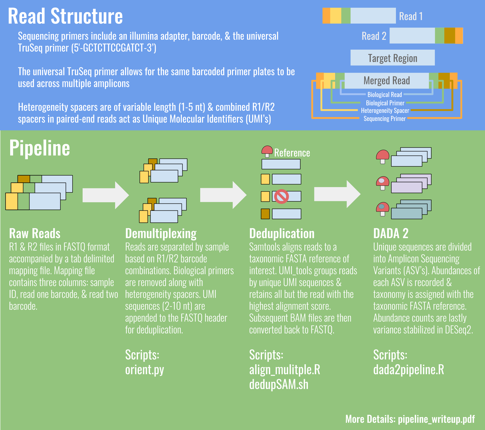

# bgmp-group-project-vineyard_fungal_assessment
Pipeline for demultiplexing, deduplication, DADA2, & variance transformation of amplicon sequencing data
generated from a novel adapter scheme developed in the McGuire Lab (University of Oregon)

INPUTS: 
Raw sequencing FASTQ output with barcode mapping file, according to the specifications of the Genomics & Cell Characterization Core Facility (GC3F) at the University of Oregon.

OUTPUTS: 
	 ASV_table.tsv       : ASV+taxonomy table DADA2 outputs 
	 ASV_summary.tsv     : Sum counts of all ASV's per sample 
	 track_reads.csv     : Table counting the number of reads kept at each step of the pipeline 
	 ASV-VT.tsv          : A variance transformed version of ASV_table.tsv 
	 phyloseq_object.RDS : phyloseq object of the variance transformed ASV with metadata 

Order: 
orient.py >
align_multiple.R >
dedupSAM.sh >
dada2pipeline.R 

